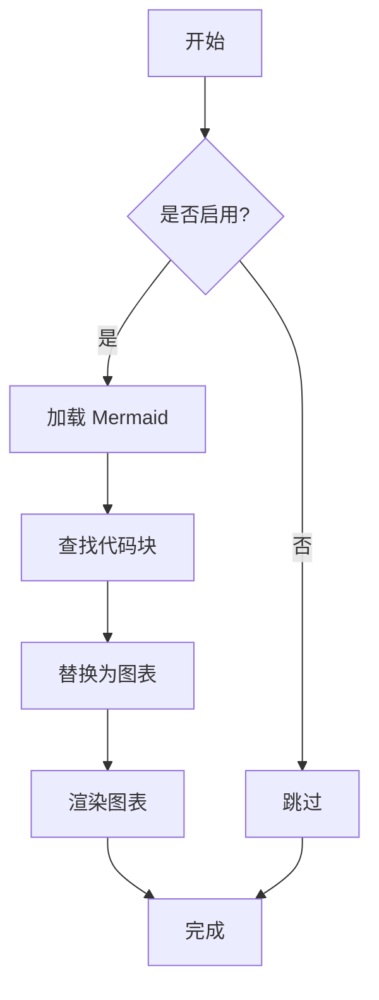
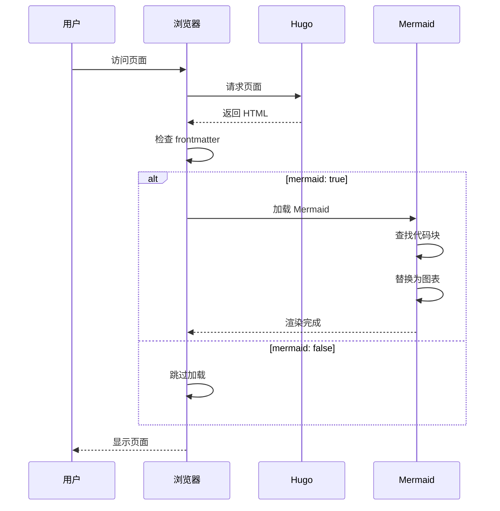
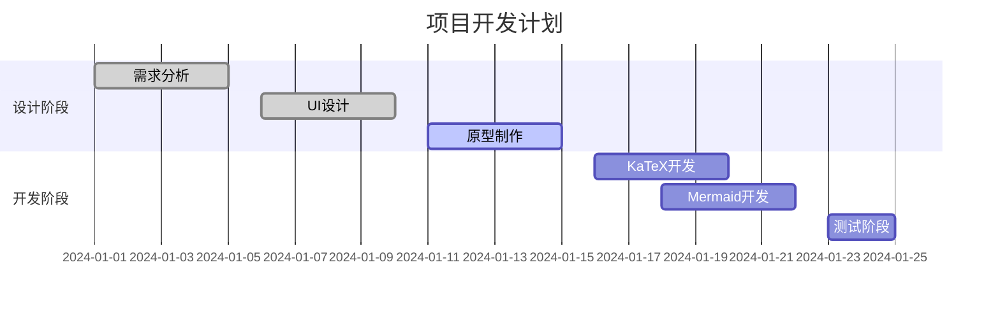
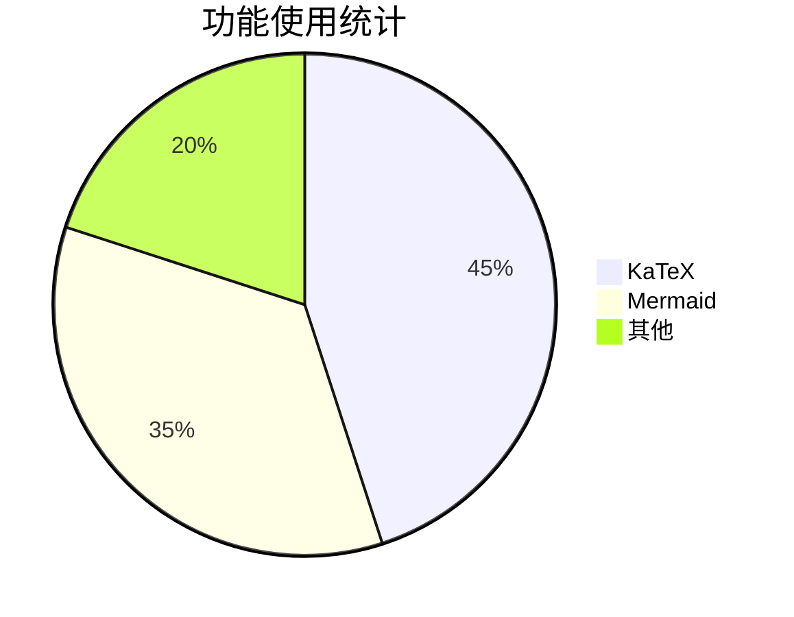

# KaTeX 和 Mermaid 功能测试

这是一个用于测试 KaTeX 数学公式和 Mermaid 图表功能的测试页面。

## 配置说明

### 页面级配置
```yaml
---
katex: true    # 启用 KaTeX
mermaid: true  # 启用 Mermaid
---
```

### 全局配置
```yaml
# hugo.yaml
katex:
  enabled: false  # 全局禁用，但页面可单独启用
  delimiters:     # 支持的分隔符
    - left: "$$"
      right: "$$"
      display: true
    - left: "$"
      right: "$"
      display: false

mermaid:
  enabled: false  # 全局禁用，但页面可单独启用
```

## KaTeX 数学公式测试

### 行内公式
这是一个行内公式：$E = mc^2$，爱因斯坦的质能方程。

另一个例子：当 $a \neq 0$ 时，方程 $ax^2 + bx + c = 0$ 的解为 $x = \frac{-b \pm \sqrt{b^2-4ac}}{2a}$。

### 块级公式

#### 二次方程求解公式
$$x = \frac{-b \pm \sqrt{b^2-4ac}}{2a}$$

#### 欧拉公式
$$e^{i\pi} + 1 = 0$$

#### 积分公式
$$\int_{-\infty}^{\infty} e^{-x^2} dx = \sqrt{\pi}$$

#### 矩阵表示
$$\begin{pmatrix} a & b \\\\ c & d \end{pmatrix} \begin{pmatrix} x \\\\ y \end{pmatrix} = \begin{pmatrix} ax + by \\\\ cx + dy \end{pmatrix}$$

#### 求和公式
$$\sum_{n=1}^{\infty} \frac{1}{n^2} = \frac{\pi^2}{6}$$

#### 常用数学符号测试
使用预定义宏：$\RR$, $\NN$, $\ZZ$, $\QQ$, $\CC$

## Mermaid 图表测试

### 流程图



### 序列图



### 甘特图




### 饼图


