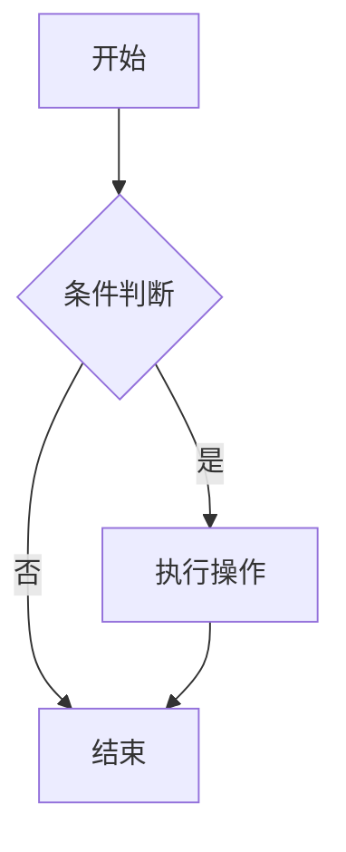

# Mermaid 图表集成说明

## 概述

本项目已成功集成 Mermaid 图表功能，支持通过 Markdown 语法直接创建各种图表，包括流程图、序列图、甘特图等。

## 功能特性

### ✅ 核心功能
- **Markdown 语法支持** - 直接使用 ```mermaid 代码块
- **条件加载** - 根据配置决定是否加载 Mermaid 库
- **主题自动适配** - 根据当前主题自动选择合适的图表主题
- **暗色模式支持** - 完美支持暗色主题切换
- **响应式设计** - 移动端友好的图表显示
- **复制功能** - 支持复制原始 Mermaid 代码
- **错误处理** - 优雅处理语法错误

### ✅ 集成特性
- **无缝集成** - 与现有代码块渲染系统完美集成
- **一致体验** - 保持与代码块相同的 UI 风格
- **主题变量** - 使用 Tailwind CSS 4.0 主题变量
- **性能优化** - 按需加载，不影响其他页面

## 配置说明

### 全局配置 (hugo.yaml)

```yaml
params:
  mermaid:
    enabled: true  # 全局启用/禁用
    theme: "default"  # 默认主题
    # 主题映射配置（自动根据当前主题选择）
    themeMapping:
      shadcn: "default"
      claude: "neutral"
      emerald: "forest"
      rose: "default"
      forest: "forest"
      vercel: "base"
      spotify: "dark"
      airbnb: "default"
```

### 页面级配置

#### 简单配置
```yaml
---
title: "我的文章"
mermaid: true  # 启用 Mermaid
---
```

#### 详细配置
```yaml
---
title: "我的文章"
mermaid:
  enabled: true
  theme: "forest"  # 指定特定主题，覆盖自动选择
---
```

## 使用方法

### 基础语法

在 Markdown 文件中使用 mermaid 代码块：

````markdown

````

### 支持的图表类型

1. **流程图 (Flowchart)**
2. **序列图 (Sequence Diagram)**
3. **甘特图 (Gantt Chart)**
4. **状态图 (State Diagram)**
5. **饼图 (Pie Chart)**
6. **类图 (Class Diagram)**
7. **ER 图 (Entity Relationship)**
8. **用户旅程图 (User Journey)**
9. **Git 图 (Git Graph)**

## 主题适配

### 自动主题映射

系统会根据当前主题自动选择合适的 Mermaid 主题：

| Hugo 主题 | Mermaid 主题 | 说明 |
|-----------|-------------|------|
| shadcn    | default     | 默认主题 |
| claude    | neutral     | 中性主题 |
| emerald   | forest      | 森林主题 |
| rose      | default     | 默认主题 |
| forest    | forest      | 森林主题 |
| vercel    | base        | 基础主题 |
| spotify   | dark        | 暗色主题 |
| airbnb    | default     | 默认主题 |

### 暗色模式

当启用暗色模式时，所有图表自动切换到 `dark` 主题。

### CSS 变量适配

图表使用以下 CSS 变量进行主题适配：

```css
--color-primary
--color-primary-foreground
--color-border
--color-secondary
--color-muted
--color-background
--color-card
--color-accent
```

## 技术实现

### 文件结构

```
layouts/
├── _default/
│   └── _markup/
│       └── render-codeblock.html  # 修改：添加 Mermaid 支持
└── partials/
    └── mermaid.html               # 新增：Mermaid 加载和配置

assets/icons/
└── chart.svg                     # 新增：图表图标

content/posts/
└── mermaid-test.md               # 新增：测试文件

docs/
└── mermaid-integration.md        # 新增：文档说明
```

### 核心逻辑

1. **代码块识别** - 在 `render-codeblock.html` 中检测 `mermaid` 语言类型
2. **条件渲染** - 为 Mermaid 代码块使用特殊的渲染逻辑
3. **库加载** - 在 `mermaid.html` 中根据配置条件加载 Mermaid 库
4. **主题适配** - 根据当前主题动态选择 Mermaid 主题
5. **图表渲染** - 将代码块内容渲染为 SVG 图表

### 关键特性

- **智能识别** - 自动识别 `language-mermaid` 代码块
- **元素替换** - 将 `<pre><code>` 替换为 `<div class="mermaid-diagram">`
- **主题监听** - 监听主题变化并重新渲染图表
- **错误处理** - 显示友好的错误信息

## 测试验证

### 测试文件

创建了 `content/posts/mermaid-test.md` 测试文件，包含：

- 各种类型的图表示例
- 主题适配测试
- 响应式设计验证
- 功能完整性检查

### 测试步骤

1. 启动 Hugo 开发服务器
2. 访问测试页面
3. 验证图表正确渲染
4. 测试主题切换
5. 检查移动端显示
6. 验证复制功能

## 故障排除

### 图表不显示

1. 检查页面配置 `mermaid: true`
2. 确认 Hugo 配置中 `mermaid.enabled: true`
3. 查看浏览器控制台错误信息
4. 验证 Mermaid 语法正确性

### 主题不匹配

1. 检查主题映射配置
2. 确认当前主题名称
3. 验证 CSS 变量定义

### 性能问题

1. 确认只在需要的页面启用 Mermaid
2. 检查图表复杂度
3. 考虑使用静态图片替代复杂图表

## 最佳实践

### 配置建议

1. **按需启用** - 只在需要的页面启用 Mermaid
2. **主题一致** - 使用自动主题映射保持一致性
3. **语法验证** - 使用 Mermaid 在线编辑器验证语法

### 性能优化

1. **条件加载** - 利用条件加载减少不必要的资源消耗
2. **图表简化** - 避免过于复杂的图表影响性能
3. **缓存利用** - 利用浏览器缓存提高加载速度

### 维护建议

1. **版本管理** - 定期更新 Mermaid 库版本
2. **测试覆盖** - 保持测试文件的完整性
3. **文档更新** - 及时更新使用文档

## 扩展功能

### 未来计划

1. **更多图表类型** - 支持更多 Mermaid 图表类型
2. **自定义主题** - 支持自定义 Mermaid 主题
3. **导出功能** - 支持图表导出为图片
4. **交互功能** - 支持图表交互功能

### 自定义扩展

可以通过修改 `layouts/partials/mermaid.html` 来：

1. 添加自定义主题变量
2. 修改渲染配置
3. 添加额外的错误处理
4. 集成其他图表库

## 总结

Mermaid 图表功能已成功集成到 Hugo Narrow 主题中，提供了完整的图表支持、主题适配和响应式设计。通过简单的配置和 Markdown 语法，用户可以轻松创建各种专业的图表。
