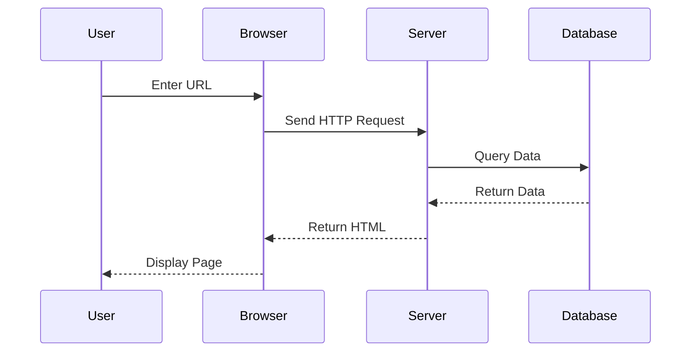

# Heading 1

This is a paragraph under a level 1 heading.

## Heading 2

This is a paragraph under a level 2 heading.

### Heading 3

This is a paragraph under a level 3 heading.

#### Heading 4

This is a paragraph under a level 4 heading.

##### Heading 5

This is a paragraph under a level 5 heading.

###### Heading 6

This is a paragraph under a level 6 heading.

## Paragraphs and Text Formatting

This is a normal paragraph. It can contain **bold text**, *italic text*, ***bold italic text***, ~~strikethrough~~, `inline code`, and [link text](https://example.com).

This is another paragraph to test spacing between paragraphs.

## Blockquotes

> This is a simple blockquote.
> 
> Blockquotes can contain multiple paragraphs.

> This is an example of a nested blockquote:
> 
> > This is nested quote content.
> > 
> > Multiple levels of nesting are possible.

## Lists

### Unordered List

- First item
- Second item
  - Nested item 1
  - Nested item 2
    - Even deeper nested item
- Third item

### Ordered List

1. First item
2. Second item
   1. Nested ordered item 1
   2. Nested ordered item 2
      1. Even deeper nested item
3. Third item

### Task List (Checkbox)

- [x] Completed task
- [ ] Incomplete task
- [x] Another completed task
- [ ] Nested task list
  - [x] Subtask 1 (done)
  - [ ] Subtask 2 (not done)
  - [x] Subtask 3 (done)

### Definition List

Term 1
: This is the definition for term 1.

Term 2
: This is the definition for term 2.
: Terms can have multiple definitions.

## Code

### Inline Code

This is a paragraph with `console.log('Hello World')` inside.

### Code Blocks

```javascript {lineNos=true hl_lines=[3,6,8] filename=main.js}
function fibonacci(n) {
  if (n <= 1) return n;
  return fibonacci(n - 1) + fibonacci(n - 2);
}


const result = fibonacci(10);
console.log(`The 10th Fibonacci number is: ${result}`);

// Async/Await
const asyncFunction = async () => {
  try {
    const response = await fetch('/api/data');
    const data = await response.json();
    return data;
  } catch (error) {
    console.error('Error fetching data:', error);
  }
};
```

## Tables

| Left Align | Center Align | Right Align |
|:-----------|:------------:|------------:|
| Content 1  | Content 2    | Content 3   |
| Longer content | Medium    | Short       |
| Data A     | Data B       | Data C      |

---

## Images


## Links

This is a [regular link](https://example.com).

This is a [link with title](https://example.com "Link Title").

This is a reference-style link: [Reference Link][1]

[1]: https://example.com "Reference Link Title"

## Footnotes

This is a paragraph with a footnote[^1].

Here is another footnote[^note].

[^1]: This is the content of the first footnote.

[^note]: This is the content of a named footnote.

## Highlighted Text

This is a paragraph with ==highlighted text==.

## Superscript and Subscript

H~2~O is the chemical formula for water.

E = mc^2^ is Einstein's mass-energy equation.

## Keyboard Keys

Press <kbd>Ctrl</kbd> + <kbd>C</kbd> to copy text.

## Math

Inline formula: $E = mc^2$

### Block Formula

$$x = \frac{-b \pm \sqrt{b^2-4ac}}{2a}$$

$$e^{i\pi} + 1 = 0$$

$$\begin{pmatrix} a & b \\\\ c & d \end{pmatrix} \begin{pmatrix} x \\\\ y \end{pmatrix} = \begin{pmatrix} ax + by \\\\ cx + dy \end{pmatrix}$$

## Mermaid



## Alert

> [!NOTE]
> This is a note.

> [!TIP]
> This is a tip.

> [!IMPORTANT]
> This is important information.

> [!WARNING]
> This is a warning.

> [!CAUTION]
> This is a caution.

> [!NOTE]+ Custom Title (Click to Collapse)
> This is an expanded foldable alert box by default. Click the title to collapse the content.


## Details

<details>
<summary>Click to expand details</summary>

This is the collapsed detailed content.

You can include any Markdown syntax here:

- List item
- **Bold text**
- `Code`

</details>


