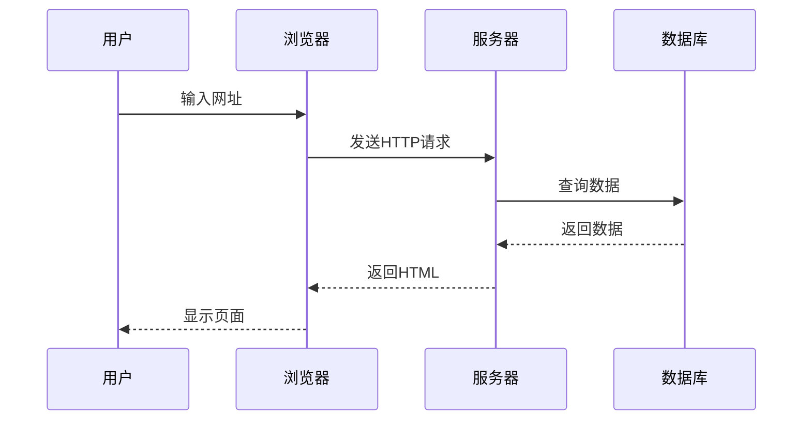

# 一级标题

这是一级标题下的段落。

## 二级标题

这是二级标题下的段落。

### 三级标题

这是三级标题下的段落。

#### 四级标题

这是四级标题下的段落。

##### 五级标题

这是五级标题下的段落。

###### 六级标题

这是六级标题下的段落。

## 段落和文本格式

这是一个普通段落。它可以包含**粗体文本**、*斜体文本*、***粗斜体文本***、~~删除线~~、`行内代码`和[链接文本](https://example.com)。

这是另一个段落，用于测试段落之间的间距。

## 引用块

> 这是一个简单的引用块。
> 
> 引用块可以包含多个段落。

> 这是一个嵌套引用的例子：
> 
> > 这是嵌套引用的内容。
> > 
> > 可以有多层嵌套。

## 列表

### 无序列表

- 第一项
- 第二项
  - 嵌套项 1
  - 嵌套项 2
    - 更深层的嵌套项
- 第三项

### 有序列表

1. 第一项
2. 第二项
   1. 嵌套有序项 1
   2. 嵌套有序项 2
      1. 更深层的嵌套项
3. 第三项

### 任务列表（复选框）

- [x] 已完成的任务
- [ ] 未完成的任务
- [x] 另一个已完成的任务
- [ ] 嵌套任务列表
  - [x] 子任务 1（已完成）
  - [ ] 子任务 2（未完成）
  - [x] 子任务 3（已完成）

### 定义列表

术语 1
: 这是术语 1 的定义。

术语 2
: 这是术语 2 的定义。
: 术语可以有多个定义。

## 代码

### 行内代码

这是一个包含 `console.log('Hello World')` 的段落。

### 代码块

```javascript {lineNos=true hl_lines=[3,6,8] filename=main.js}
function fibonacci(n) {
  if (n <= 1) return n;
  return fibonacci(n - 1) + fibonacci(n - 2);
}


const result = fibonacci(10);
console.log(`The 10th Fibonacci number is: ${result}`);

// Async/Await
const asyncFunction = async () => {
  try {
    const response = await fetch('/api/data');
    const data = await response.json();
    return data;
  } catch (error) {
    console.error('Error fetching data:', error);
  }
};
```

## 表格

| 左对齐 | 居中对齐 | 右对齐 |
|:-------|:--------:|-------:|
| 内容 1 | 内容 2   | 内容 3 |
| 较长的内容 | 中等     | 短     |
| 数据 A | 数据 B   | 数据 C |


---

## 图片


## 链接

这是一个[普通链接](https://example.com)。

这是一个[带标题的链接](https://example.com "链接标题")。

这是一个引用式链接：[引用链接][1]

[1]: https://example.com "引用链接标题"

## 脚注

这是一个包含脚注的段落[^1]。

这里是另一个脚注[^note]。

[^1]: 这是第一个脚注的内容。

[^note]: 这是命名脚注的内容。

## 高亮文本

这是一个包含==高亮文本==的段落。

## 上标和下标

H~2~O 是水的化学分子式。

E = mc^2^ 是爱因斯坦的质能方程。

## 键盘按键

按 <kbd>Ctrl</kbd> + <kbd>C</kbd> 复制文本。


## 数学公式

行内公式: $E = mc^2$

### 块级公式

$$x = \frac{-b \pm \sqrt{b^2-4ac}}{2a}$$

$$e^{i\pi} + 1 = 0$$

$$\begin{pmatrix} a & b \\\\ c & d \end{pmatrix} \begin{pmatrix} x \\\\ y \end{pmatrix} = \begin{pmatrix} ax + by \\\\ cx + dy \end{pmatrix}$$

## 图表



## 提示框

> [!NOTE]
> 这是一个注意事项。

> [!TIP]
> 这是一个提示。

> [!IMPORTANT]
> 这是重要信息。

> [!WARNING]
> 这是一个警告。

> [!CAUTION]
> 这是一个注意事项。

> [!NOTE]+ 自定义标题（默认展开）
> 这是一个可折叠的提示框，默认展开，点击折叠。


## 详情（如果支持）

<details>
<summary>点击展开详情</summary>

这是折叠的详细内容。

你可以在这里包含任何 Markdown 语法：

- 列表项
- **粗体文本**
- `代码`

</details>

